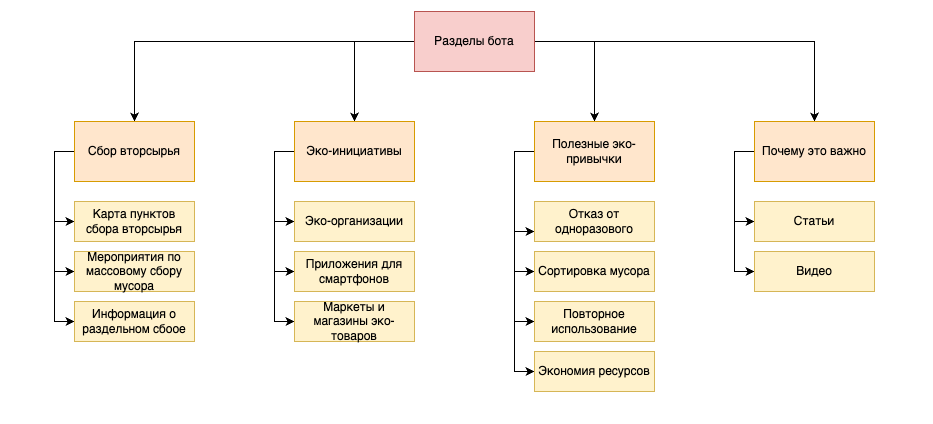
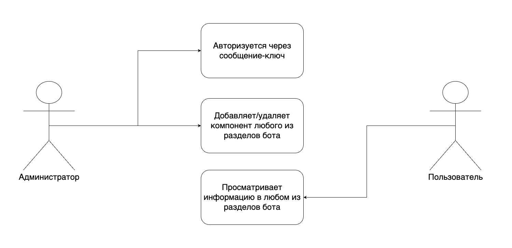
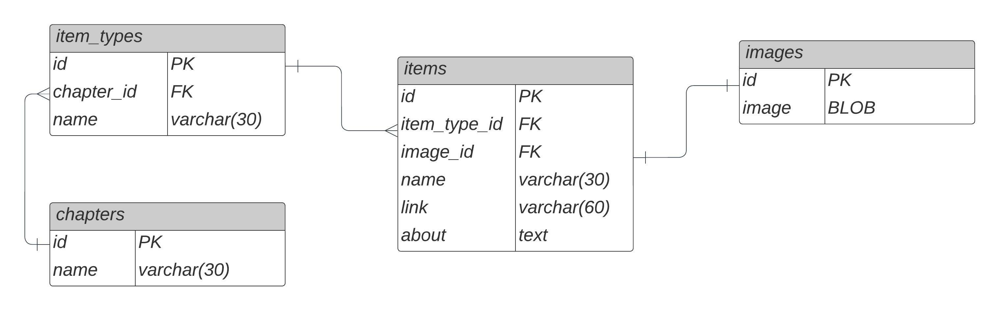
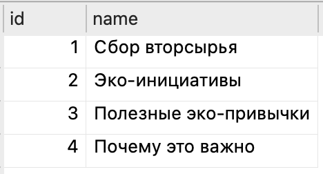
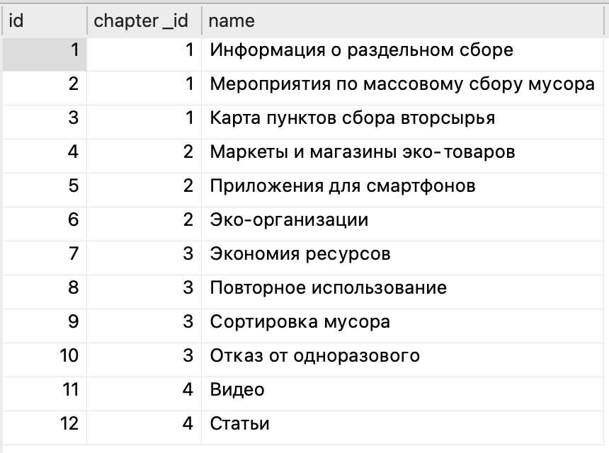

## Справочный ЭкоБот Казань
#### Глоссарий

<i>ЭкоБот</i> – бот в мессенджере Telegram для получения актуальной информации, касающейся эко-инициатив города Казани, а также полезной информации, касающейся экологии в целом. 

<i>Пользователь</i> – лицо, использующее бота для получения справочной информации. 

<i>Администратор</i> – лицо, администрирующее бота, добавляющее туда новую информацию. 

<i>Эко-инициатива</i> – любая коммерческая и некоммерческая организация или мероприятие, призванное освещать или решать проблемы экологии. 

#### Цель документа
Выявить проблему, ее актуальность, а также аргументировать выбор пути ее цифрового решения. Описать структуру и функционал цифрового решения для разработки и последующего сопровождения его работы. 

## Раздел 1 – Описание проекта
#### Описание предметной области

Одними из самых важных и актуальных проблем современности являются проблемы, связанные с экологией. Существует множество путей их решений, в том числе различные инициативы, позволяющие освещать экологические проблемы и прививать людям правильные с точки зрения защиты природы привычки. Каждый может внести свой вклад в спасение экологии планеты, но не каждый знает, как он может помочь. 

В городе Казань существует множество способов сделать свою жизнь более экологичной, но порой сложно собрать всю информацию обо всех проектах и мероприятиях. 

В Казани существуют: 

- пункты сбора вторсырья;
- организации, устраивающие массовый сбор мусора на переработку и потом отвозящие его в пункты приема;
- организации, занимающиеся сбором пригодной для носки одежды;
- экотакси, забирающее отсортированный мусор на переработку из домов;
- приложение для смартфона, помогающее в сборе вторсырья в Казани;
- субботники и т.д. 

После исследования проблемы путем анализа была выявлена необходимость в некотором справочнике эко-инициатив города Казани, который позволил бы в удобном виде находить необходимую информацию быстро и просто. 
#### Анализ существующих решений

Существующее решение | Плюсы | Минусы
---------------------|-------|-------
Группы ВК | • Удобство выкладки информации; •	Широкий функционал. | •	Сейчас все больше людей отказывается от использования ВК; •	Новости теряются в ленте, а группа теряется среди множества других групп пользователя; •	У каждой инициативы своя группа, а если делать отдельную справочную, то нужно постоянно ее вести вручную.
Приложение для смартфонов "Вторплюс" | • Широкий функционал; •	Много встроенных микросервисов; •	Устанавливается на смартфон как приложение. | •	Не каждый человек захочет ставить еще одно приложение и тратить на это память устройства; •	Все еще является сборником инициатив всего одной организации.
Аккаунты в инстаграме | • Удобство в информировании, вытекающее из способов показа контента в этой социальной сети; • Удобство ведения аккаунта, широкий функционал. | •	Если пользователь не взаимодействует с аккаунтом постоянно, то он пропадает из его ленты; • Сложность использования приложения из-за того, что оно заблокировано на территории РФ.

<i>Таблица 1 – Положительные и отрицательные стороны существующих решений проблемы.</i> 

Из таблицы 1 можно сделать вывод, что хоть уже существуют некоторые решения данной проблемы, но в них есть множество минусов, необходимость закрытия которых делает данную работу актуальной. 

#### Предлагаемое решение

Для того, чтобы решить в первую очередь проблему универсальности разрабатываемого ресурса, необходимо в первую очередь сделать его на платформе, уже используемой большим количеством людей. Такой платформой является мессенджер Telegram, который, помимо прочего, обладает функционалом, позволяющим создавать для него ботов – программу, которая взаимодействует с пользователем с помощью сообщений внутри самого мессенджера. В данном проекте предполагается разработка именно telegram-бота. 

Бот в качестве справочника имеет следующие преимущества: 

- пользователь при необходимости сам запрашивает нужную ему информацию, а не ищет ее среди тысячи постов на странице в ВК или Инстаграме;
- администратору нужно только добавлять актуальную и удалять неактуальную информацию, а не заниматься продвижением страницы для того, чтобы всегда оставаться на виду у пользователей;
- функционал бота можно расширять в любую сторону (например, добавить оповещение о предстоящих мероприятиях), при этом не останавливая его работу;
- можно добавлять все известные инициативы без привязки к какой-либо конкретной организации. 

#### Задача проекта

В срок до 01.11.2022 запустить справочного ЭкоБота города Казань. 

<b>План разработки</b>

01.10.2022 – 05.10.2022 – разработка проекта и документации, обсуждение с научным руководителем. 

06.10.2022 – 15.10.2022 – написание кода и отладка его работы. 

16.10.2022 – 25.10.2022 – тестирование и исправление ошибок, написание дополнительных функций. 

26.10.2022 – 01.11.2022 – финальное обсуждение с научным руководителем, запуск бота и отправка проекта на конкурс. 

## Раздел 2 – Моделирование системы

#### Разделы бота

Так как предполагается, что бот в первую очередь выполняет функцию справочника, необходимо определить, какие разделы он будет содержать. Это представлено на рисунке 1. 

Вся информация будет взята из открытых источников в интернете: на официальных сайтах экологических организации, на профильных страницах в социальных сетях, из научных статей и с других ресурсов. ЭкоБот не предполагает использование какой-либо уникальной авторской информации, а только ее концентрирование в одном ресурсе с указанием на источники. 

#### Формализация пользовательских сценариев

На рисунке 2 изображена диаграмма, описывающая действия, которые могут совершить те или иные группы пользователей при взаимодействии с ботом. 

#### Проектирование базы данных

База данных будет написана на базе SQLite3 и будет иметь структуру, описанную на рисунке ниже. Название файла – ecobot.db. 

Через админ-панель можно будет добавить какую-либо составляющую подразделов, но сами подразделы и разделы будут оставаться постоянными, их может изменять только разработчик. 

В таблицах item_types и chapters будут храниться данные о разделах и подразделах бота, поэтому они будут предопределены заранее согласно схеме декомпозиции бота. Их содержания на рисунках ниже.

 

#### Архитектура проекта
Данный проект – монолитный и не предполагает дальнейшего масштабирования, поэтому в нем будет использоваться принципы многослойной архитектуры, а именно разделение исходного кода на 3 слоя: слой представления (interface.py), слой бизнес-логики (logic.py) и слой передачи данных (db.py), а также файл запуска бота (edgine.py). 

В слое представления будет реализована логика взаимодействия пользователя с Экоботом с помощью интерфейса мессенджера. 

В слое бизнес-логики будут описываться способы непосредственно работы бота. 

В слое передачи данных будут реализованы функции для взаимодействия с базой данных. 
